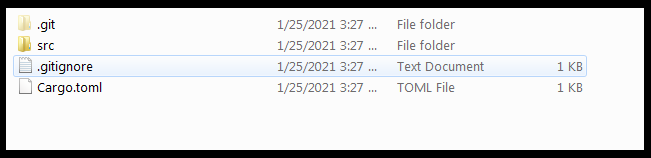
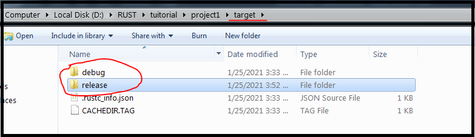

# How to run the Hellow World! program in RUST Lang

| Method 1 | Method 2 | 
| :---     | :---    |
| **1.** from cli --- do ```cargo init <project_name>``` from any directory   | **1.** create a Directory ```mkdir <project_name>``` and ```cd <project_name>``` |
| **2.** it will create ```<project_name>``` directory inside parent directory  with all project files  | **2.** from cli --- do ```cargo init .``` from ```<project_name>``` directory , it will cretae project files in side ```<project_name>``` directory |
| **3.** all Done | **3.**  all Done | 

---

* once ```cargo init .``` or  ```cargo init <project_name>``` command is pressed it will generate following folder structre in ```<project_name>``` directory .



* cargo will automatically do the GIT inittiation .
* cargo will generate a ```src``` directory with ```main.rs``` file , which contain Hellow world print statement.
* ```cargo.toml``` will contain dependency list , some meta data related to project, it similar to ```package.json```
* now we can go for building the app

---

# Building app the in debug mode


* from CLI do --- ``` cargo build```, will build the app in debug mode. 

* ``` cargo build``` will generate target directory inside that there will be debug directory, with ```<project_name>.exe```


---

# Building app the in release mode

* from CLI do --- ``` cargo build --release```, will build the app in debug mode. 

* ``` cargo build --release``` will generate release directory inside target directory, with ```<project_name>.exe```



